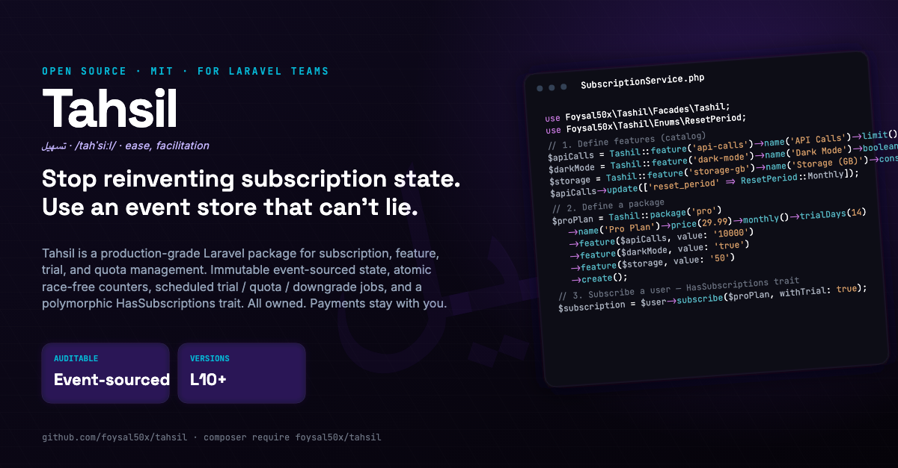

<!-- markdownlint-disable-next-line MD033 MD041 -->
<p align="center"></p>

# Tashil – Subscription Management for Laravel

**Tashil** (تسهيل) is a Laravel package for **subscription and feature management** with an immutable event store, atomic usage tracking, scheduled trial / quota / downgrade jobs, and a polymorphic subscriber trait.

It **owns** plan definitions, subscription state, feature gating, usage counters, trial lifecycle, scheduled transitions, and invoice issuance.

It **does not charge** — payment capture, dunning retries, refunds, and gateway reconciliation are delegated to a third-party integration in the host application.

---

## Table of Contents

- [Installation](#installation)
- [Quick Start](#quick-start)
- [Configuration](#configuration)
- [Subscriptions](#subscriptions)
- [Feature System](#feature-system)
- [Trial System](#trial-system)
- [Invoices & transactions](#invoices--transactions)
- [Scheduler](#scheduler)
- [Events](#events)
- [Analytics & Reporting](#analytics--reporting)
- [Subscribable + HasSubscriptions Trait](#subscribable--hassubscriptions-trait)
- [Route Middleware](#route-middleware)
- [Caching Architecture](#caching-architecture)
- [Documentation](#documentation)
- [Testing](#testing)
- [License](#license)

---

## Installation

### Requirements

- PHP 8.2 — 8.5
- Laravel 10.x, 11.x, 12.x, or 13.x
- Redis (optional — only when the caching layer is enabled)

Per-version compatibility:

| Laravel | Released | PHP | Manual scheduler wiring location |
|---|---|---|---|
| 10.x | Feb 2023 | 8.2 / 8.3 | `app/Console/Kernel.php` |
| 11.x | Mar 2024 | 8.2 / 8.3 / 8.4 | `routes/console.php` or `bootstrap/app.php` `->withSchedule()` |
| 12.x | Feb 2025 | 8.2 – 8.5 | `routes/console.php` or `bootstrap/app.php` `->withSchedule()` |
| 13.x | Mar 2026 | 8.3 / 8.4 / 8.5 | `routes/console.php` or `bootstrap/app.php` `->withSchedule()` |

Auto-registration (`tashil.schedule.enabled = true`, default) is **version-agnostic** — the same provider wires correctly under L10's Kernel and L11+/L13's `bootstrap/app.php` flow. You only have to think about Laravel versions if you disable auto-registration and wire commands yourself; see [docs/04-Scheduler-Jobs.md](docs/04-Scheduler-Jobs.md#disabling-auto-registration) for L10 / L11+ examples side-by-side.

### Install via Composer

```bash
composer require foysal50x/tashil
```

### Publish configuration and run migrations

```bash
php artisan vendor:publish --tag=tashil-config
php artisan vendor:publish --tag=tashil-migrations
php artisan migrate
```

---

## Quick Start

```php
use Foysal50x\Tashil\Contracts\Subscribable;
use Foysal50x\Tashil\Facades\Tashil;
use Foysal50x\Tashil\Enums\ResetPeriod;
use Foysal50x\Tashil\Traits\HasSubscriptions;

// 0. Make your subscriber model Subscribable (User, Team, Tenant, ...)
class User extends Authenticatable implements Subscribable
{
    use HasSubscriptions;
}

// 1. Define features (catalog)
$apiCalls = Tashil::feature('api-calls')->name('API Calls')->limit()->create();
$darkMode = Tashil::feature('dark-mode')->name('Dark Mode')->boolean()->create();
$storage  = Tashil::feature('storage-gb')->name('Storage (GB)')->consumable()->create();
$aiTokens = Tashil::feature('ai-tokens')->name('AI Tokens')->metered()->create();

$apiCalls->update(['reset_period' => ResetPeriod::Monthly]); // resets each month

// 2. Define a package
$proPlan = Tashil::package('pro')
    ->name('Pro Plan')
    ->price(29.99)
    ->monthly()
    ->trialDays(14)
    ->feature($apiCalls, value: '10000')
    ->feature($darkMode, value: 'true')
    ->feature($storage,  value: '50')
    ->feature($aiTokens, value: '0.001')   // metered: 0.001 USD per token
    ->create();

// 3. Subscribe a user
$subscription = Tashil::subscription()->subscribe($user, $proPlan, withTrial: true);

// 4. Gate access + track usage
if ($user->hasFeature('api-calls')) {
    $user->useFeature('api-calls');         // atomic increment, returns false if over limit
}

// 5. Metered consume — charges (units × unit_price) via MeteredBilling
$user->useFeature('ai-tokens', 1500);       // returns false on insufficient balance

// 6. Report absolute usage for storage-style features
$user->reportStorage('storage-gb', 38.5);   // 38.5 GB

// 7. Lifecycle ops
$user->cancelSubscription();                                 // grace cancel
$user->pauseSubscription(); $user->unpauseSubscription();
$user->scheduleDowngrade($basicPlan);                        // applied at period end
$user->switchPlan($enterprisePlan);                          // immediate

// 8. Analytics
$kpis = Tashil::analytics()->dashboardSummary();
```

---

## Configuration

After publishing, edit `config/tashil.php`:

```php
return [
    'database' => [
        'connection' => env('TASHIL_DB_CONNECTION', null),
        'prefix'     => 'tashil_',
        'tables' => [
            'packages'              => 'packages',
            'features'              => 'features',
            'package_feature'       => 'package_feature',
            'subscriptions'         => 'subscriptions',
            'subscription_features' => 'subscription_features',
            'feature_usages'        => 'feature_usages',
            'usage_logs'            => 'usage_logs',
            'subscription_events'   => 'subscription_events',
            'invoices'              => 'invoices',
            'transactions'          => 'transactions',
        ],
    ],

    'invoice' => [
        'prefix'    => 'INV',
        'format'    => '#-YYMMDD-NNNNNN',
        'generator' => Foysal50x\Tashil\Services\Generators\InvoiceNumberGenerator::class,
    ],

    'transaction' => [
        'prefix'    => 'TXN',
        'format'    => '#-YYMMDD-NNNNNNAA',
        'generator' => Foysal50x\Tashil\Services\Generators\TransactionIdGenerator::class,
    ],

    'currency' => env('TASHIL_CURRENCY', 'USD'),

    'trial' => [
        'warn_days'  => env('TASHIL_TRIAL_WARN_DAYS', 3),
        'grace_days' => env('TASHIL_TRIAL_GRACE_DAYS', 0),
    ],

    'renewal' => [
        'on_pending_invoice' => env('TASHIL_RENEWAL_ON_PENDING_INVOICE', 'cancel'),
        'grace_days'         => env('TASHIL_RENEWAL_GRACE_DAYS', 3),
    ],

    'schedule' => [
        'enabled'   => env('TASHIL_SCHEDULE_ENABLED', true),
        'overrides' => [],
    ],

    'events' => [
        'async' => env('TASHIL_EVENTS_ASYNC', true),
    ],

    'middleware' => [
        'aliases' => [
            'subscribed' => 'subscribed',
            'plan'       => 'plan',
            'feature'    => 'feature',
        ],
    ],

    'redis' => [/* … */],
    'cache' => [/* … */],
];
```

---

## Subscriptions

### Subscription states

| State | Enum case | Means |
|---|---|---|
| Pending | `SubscriptionStatus::Pending` | Initial placeholder. |
| Active | `SubscriptionStatus::Active` | Currently active. |
| OnTrial | `SubscriptionStatus::OnTrial` | In trial — strict: `trial_ends_at` must be in the future. |
| PastDue | `SubscriptionStatus::PastDue` | Host marks this when payment is late. |
| Paused | `SubscriptionStatus::Paused` | Host paused; counter still exists but `isValid()` is false. |
| PendingCancellation | `SubscriptionStatus::PendingCancellation` | Grace-cancelled — still valid until `ends_at`. |
| Cancelled | `SubscriptionStatus::Cancelled` | Immediately cancelled, access revoked. |
| Expired | `SubscriptionStatus::Expired` | Past access window. |
| Suspended | `SubscriptionStatus::Suspended` | Admin-suspended. |

### Lifecycle

```text
subscribe ─► Active ───────────────► PendingCancellation ─► Expired
       │      │                        ▲
       │      ├─► Paused ─► Active     │
       │      ├─► switched (new sub)   │
       │      └─► Cancelled            │
       └─► OnTrial ─► (convert) ─► Active
                  └─► (expire) ─► Expired
```

### Service API

```php
use Foysal50x\Tashil\Facades\Tashil;

Tashil::subscription()->subscribe($user, $package, withTrial: true);
Tashil::subscription()->cancel($sub);                              // grace
Tashil::subscription()->cancel($sub, immediate: true, reason: 'x');
Tashil::subscription()->resume($sub);                              // only PendingCancellation
Tashil::subscription()->pause($sub); Tashil::subscription()->unpause($sub);
Tashil::subscription()->switchPlan($sub, $newPackage);
Tashil::subscription()->scheduleDowngrade($sub, $targetPackage);
Tashil::subscription()->cancelPendingChange($sub);
Tashil::subscription()->convertTrial($sub);
Tashil::subscription()->expireTrial($sub);
Tashil::subscription()->expire($sub);
Tashil::subscription()->advancePeriod($sub);    // invoked by InvoiceObserver
```

### Grace cancellation semantics

`cancel(immediate: false)` does **not** revoke access. The subscription enters `PendingCancellation`, keeps `ends_at`, and stays in the `Subscription::valid()` scope. The `tashil:expire-subscriptions` job promotes it to `Expired` once `cancellation_effective_at` passes. `$user->subscribed()` returns `true` for the entire grace window.

### Immutable event log

Every transition appends to `tashil_subscription_events` with a monotonic per-subscription `sequence_num` (assigned under a `SELECT … FOR UPDATE` lock) and an optional `idempotency_key`. Read it back:

```php
$sub->events()->orderBy('sequence_num')->get();

Tashil::events()->append($sub, 'host.custom.thing', payload: [...], idempotencyKey: 'op-42');
```

See [docs/05-Reporting-Data-Model.md](docs/05-Reporting-Data-Model.md).

---

## Feature System

Five feature types, all with consistent storage + atomic enforcement:

| Type | Behavior |
|---|---|
| `FeatureType::Boolean` | Pure on/off; `value` is `"true"` or `"false"`. |
| `FeatureType::Limit` | Numeric quota with hard enforcement via atomic conditional UPDATE. |
| `FeatureType::Consumable` | Tracked usage without a hard ceiling (soft metering). |
| `FeatureType::Enum` | Named option / tier label. |
| `FeatureType::Metered` | Per-unit charge deducted from the subscriber's balance via a host-implemented `MeteredBilling`. Pivot `value` is the unit price (decimal string). |

### Reset cadence (`ResetPeriod`)

`never` / `daily` / `weekly` / `monthly` / `yearly`. The `tashil:reset-quotas` job advances `period_start`/`period_end` anchored to the previous `period_end` — a late cron doesn't drift the cadence.

### Snapshot + counter

On subscribe (or on plan switch), tahsil writes **two rows per feature**:

- `tashil_subscription_features` — **immutable** snapshot of the feature config at that moment. Old snapshots are stamped `superseded_at` and kept forever.
- `tashil_feature_usages` — **mutable** counter with cached `limit_value`, period window, and the running `usage` value.

### Atomic increment

```php
$user->useFeature('api-calls', 1);
```

becomes:

```sql
UPDATE tashil_feature_usages
SET usage = usage + :amount
WHERE id = :id
  AND (limit_value IS NULL OR usage + :amount <= limit_value)
```

Two concurrent callers cannot both succeed past the limit. The increment returns `false` on rejection without touching the row. Every successful change writes `previous_usage` + `new_usage` to `tashil_usage_logs`.

### Absolute reporting

```php
$user->reportStorage('storage-gb', 12.5);
```

Use when the host knows the absolute value (storage bytes, AI compute hours). `UsageLimitWarning` fires only on crossings of 80%, not on every report. Rejected for metered features (delta-charge model, not absolute set).

### Metered features

```php
// Feature defined once; pivot value = unit price (USD per unit).
$aiTokens = Tashil::feature('ai-tokens')->metered()->create();
Tashil::package('payg')->price(0)->monthly()
    ->feature($aiTokens, value: '0.001')
    ->create();

// Consuming charges (units × unit_price) via the bound provider.
// Returns false if the provider declines (insufficient balance, etc.).
$user->useFeature('ai-tokens', 100);   // charges 0.10 USD

// Pass a stable idempotency key on retryable call paths (request id, job
// uuid). It flows verbatim to the provider in $context['idempotency_key'];
// when omitted, Tashil generates a fresh UUID per call.
$user->useFeature('ai-tokens', 100, idempotencyKey: $request->header('X-Idempotency-Key'));
```

Tashil never owns balances. Implement `MeteredBilling` using whichever pattern fits — Tashil checks the subscriber per consume, no flag to flip:

```php
// Pattern A — self-implement on the Subscribable model (no binding needed)
class User extends Authenticatable implements Subscribable, MeteredBilling
{
    use HasSubscriptions;

    public function getBalance(Subscribable $s, string $currency): float        { /* ... */ }
    public function hasSufficientBalance(Subscribable $s, string $currency, float $a): bool { /* ... */ }
    public function charge(Subscribable $s, string $currency, float $a, array $ctx = []): bool { /* ... */ }
}

// Pattern B — standalone class bound via the container
$this->app->bind(
    \Foysal50x\Tashil\Contracts\MeteredBilling::class,
    \App\Billing\WalletMeteredBilling::class,
);
```

Mix freely — different subscriber types can use different patterns. Without either (and the default `NullMeteredBilling` still bound), `useFeature` for a metered feature throws `MeteredBillingNotConfiguredException` so misconfiguration fails loud. On success Tashil fires `MeteredCharged`; on rejection it fires `MeteredChargeRejected`.

See [docs/02-Feature-System.md › Metered features](docs/02-Feature-System.md#metered-features) for both patterns side-by-side, the idempotency requirements, and consumption flow.

---

## Trial System

Trials are first-class. Four timestamps capture the entire lifecycle: `trial_started_at`, `trial_ends_at`, `trial_converted_at`, `trial_expired_at`.

```php
Tashil::subscription()->subscribe($user, $package, withTrial: true);
Tashil::subscription()->convertTrial($sub);
Tashil::subscription()->expireTrial($sub);
```

The `tashil:mark-trials-ending` job dispatches `TrialEnding` `tashil.trial.warn_days` (default 3) before expiry; `tashil:expire-trials` runs every 30 minutes and promotes overdue, unconverted trials to `Expired`.

`isOnTrial()` is strict: status must be `OnTrial` AND `trial_ends_at` in the future. A cancelled-mid-trial subscription never reports as on-trial.

See [docs/03-Trial-System.md](docs/03-Trial-System.md).

---

## Invoices & transactions

Tahsil issues invoices on subscribe (non-trial) and renewal, and keeps a **transaction ledger** of the payments/refunds the host reports. The host moves the money; Tahsil records it and reflects the invoice state.

```php
$invoice = Tashil::billing()->generateInvoice($subscription);

// host charges via gateway, then records the result in ONE call:
Tashil::billing()->recordPayment($invoice, gateway: 'stripe', transactionId: 'ch_…');
// → writes a success Transaction + marks the invoice paid (InvoiceObserver
//   advances/activates by kind) + fires PaymentRecorded & InvoicePaid.
//   Idempotent on UNIQUE(gateway, transaction_id) — safe for replayed webhooks.

// declined charge → audit only; invoice stays pending for dunning:
Tashil::billing()->recordFailedPayment($invoice, gateway: 'stripe');

// refund the host already executed at the gateway (full or partial):
Tashil::billing()->recordRefund($transaction, amount: 12.50, reason: 'customer request');
// → partial keeps Success/Paid; full flips Transaction→Refunded + Invoice→Refunded; fires PaymentRefunded.
```

Read invoices/transactions through the billing API instead of querying the `Invoice` model directly — the access path stays behind the (overridable) repository:

```php
Tashil::billing()->latestInvoice($subscription);                       // most recent invoice
Tashil::billing()->latestInvoice($subscription, InvoiceKind::Initial); // most recent of a kind
Tashil::billing()->pendingInvoice($subscription);                      // outstanding bill to pay (or null)
Tashil::billing()->overdueInvoice($subscription);                      // pending + past due (or null)
Tashil::billing()->successfulTransaction($invoice);                    // the settled charge a refund targets
```

`Invoice::markAsPaid()` / `markAsVoid()` / `markAsRefunded()` remain as low-level state transitions, but `recordPayment` / `recordRefund` are the complete, idempotent path (they also write the transaction row). Invoice statuses: `draft`, `pending`, `paid`, `void`, `refunded`. Transaction statuses: `pending`, `success`, `failed`, `refunded`.

Invoice numbers are generated by `tashil.invoice.generator` — default `InvoiceNumberGenerator` parses the format string `#-YYMMDD-NNNNNN` (e.g. `INV-260522-849021`).

Both built-in generators implement `Foysal50x\Tashil\Contracts\ShouldBeUnique` — they pre-check the rendered id against the live table (`invoice_number` globally; `TransactionIdGenerator` against the composite `(gateway, transaction_id)`, so the same id under a different gateway is allowed) and re-render on a hit, bounded by `maxGenerationAttempts()` before throwing `UniqueIdGenerationException`. The pre-check only narrows the window; the DB unique constraint is the real guarantee under concurrency, and the host owns retry on an actual collision. Supply your own generator to change the uniqueness scope, or implement `generate()` without the contract to skip the check. See [docs/06-Developer-Guide.md › Guaranteed-unique ids](docs/06-Developer-Guide.md#guaranteed-unique-ids).

---

## Scheduler

Six idempotent commands. Auto-registered with `->onOneServer()`:

| Command | Default cron | Purpose |
|---|---|---|
| `tashil:renew-subscriptions` | daily 00:05 | Issue renewal invoices when `current_period_end` has elapsed. |
| `tashil:expire-subscriptions` | every 15 min | Promote out-of-window subs to `Expired`. |
| `tashil:expire-trials` | every 30 min | Promote overdue, unconverted trials. |
| `tashil:mark-trials-ending` | daily 07:55 | Dispatch `TrialEnding`. |
| `tashil:reset-quotas` | daily 00:00 | Zero counters whose period has elapsed; advance window. |
| `tashil:apply-pending-changes` | every 5 min | Apply scheduled package changes. |

Override per-command cron via `tashil.schedule.overrides`. Set `tashil.schedule.enabled = false` to disable auto-wiring entirely.

See [docs/04-Scheduler-Jobs.md](docs/04-Scheduler-Jobs.md).

---

## Events

All events dispatch after `DB::afterCommit()` so listeners never see torn state (unless `tashil.events.async = false`).

| Event | When |
|---|---|
| `SubscriptionCreated` | New subscription persisted. |
| `SubscriptionCancelled` | `cancel()` — carries `immediate` flag + reason. |
| `SubscriptionResumed` | Resume from `PendingCancellation`. |
| `SubscriptionExpired` | `expire()` or the expire-subscriptions job. |
| `SubscriptionSwitched` | `switchPlan()` — carries old + new sub and package. |
| `SubscriptionPaused` / `SubscriptionUnpaused` | Pause / unpause. |
| `SubscriptionRenewed` | Triggered by `InvoiceObserver` when an invoice is marked paid. |
| `PendingChangeScheduled` / `PendingChangeApplied` | `scheduleDowngrade()` lifecycle. |
| `TrialEnding` | `tashil:mark-trials-ending` — carries `daysRemaining`. |
| `TrialConverted` | `convertTrial()`. |
| `TrialExpired` | `expireTrial()` or the expire-trials job. |
| `UsageReset` | Manual or scheduled reset. |
| `UsageLimitWarning` | 80% threshold crossed (fired once per period). |
| `MeteredCharged` | Metered `useFeature()` charge accepted — carries units, unit price, amount, currency. |
| `MeteredChargeRejected` | Metered charge declined (insufficient balance / provider refusal). |
| `InvoiceIssued` / `InvoicePaid` / `InvoiceVoided` / `InvoiceOverdue` | Invoice lifecycle. |
| `PaymentRecorded` / `PaymentFailed` / `PaymentRefunded` | Transaction ledger — `recordPayment()` / `recordFailedPayment()` / `recordRefund()`; carry the transaction + invoice. |

Listen normally:

```php
Event::listen(SubscriptionExpired::class, fn ($e) => /* … */);
```

---

## Analytics & Reporting

`Tashil::analytics()` provides live aggregates with cross-database queries (`tpetry/laravel-query-expressions`, no raw SQL):

```php
Tashil::analytics()->dashboardSummary();
Tashil::analytics()->packageAnalytics();
Tashil::analytics()->calculateMRR();
Tashil::analytics()->churnRate(days: 30);
Tashil::analytics()->churnTrend(months: 12, windowDays: 30);   // 2 queries
Tashil::analytics()->trialConversionRate();
Tashil::analytics()->totalRevenue();
Tashil::analytics()->revenueByPackage();
Tashil::analytics()->revenueByPeriod(months: 12);
Tashil::analytics()->getDailyUsage($sub, $featureId, days: 30);
```

For audit / point-in-time questions, walk the event log + feature snapshots — see [docs/05-Reporting-Data-Model.md](docs/05-Reporting-Data-Model.md).

---

## Subscribable + HasSubscriptions Trait

Any Eloquent model can be a subscriber by implementing the `Subscribable` contract and applying the `HasSubscriptions` trait:

```php
use Foysal50x\Tashil\Contracts\Subscribable;
use Foysal50x\Tashil\Traits\HasSubscriptions;

class User extends Authenticatable implements Subscribable
{
    use HasSubscriptions;
}
```

`implements Subscribable` is **required** — every library type-hint accepts `Subscribable`, not Eloquent's `Model`. The trait provides default implementations for all four interface methods.

Override `resolveSubscription()` to change which subscription represents "the active one" for multi-sub / tenant scenarios:

```php
public function resolveSubscription(): ?Subscription
{
    return $this->subscriptions()->valid()
        ->where('package_id', $this->currentWorkspace->preferredPackageId)
        ->first();
}
```

Surface:

```php
// Lifecycle
$user->subscribe($package, withTrial: false);
$user->cancelSubscription(immediate: false, reason: '…');
$user->resumeSubscription();
$user->switchPlan($newPackage);
$user->pauseSubscription();   $user->unpauseSubscription();
$user->scheduleDowngrade($targetPackage);

// State
$user->subscribed();           // true if Active / OnTrial / PendingCancellation (grace)
$user->subscribedTo($pkg);     // by Package model or slug
$user->onPlan('pro');
$user->onTrial();              // strict
$user->paused();
$user->pendingChange();        // returns target Package or null
$user->subscription();         // hits DB
$user->loadSubscription();     // cached for request lifecycle
$user->clearSubscriptionCache();

// Features
$user->hasFeature('dark-mode');
$user->featureValue('api-calls');
$user->featureUsage('api-calls');      // float
$user->featureRemaining('api-calls');  // float|null (null = unlimited)
$user->useFeature('api-calls', 1);
$user->reportStorage('storage-gb', 12.5);
$user->dailyUsageFor('api-calls', days: 30);

// Invoices
$user->invoices();             // Collection of all invoices across all subs
```

`loadSubscription()` caches the active subscription for the model instance — feature checks and usage operations all share the same row. It calls `resolveSubscription()` exactly once per request lifecycle, so overrides take effect uniformly.

---

## Route Middleware

Three middleware ship and auto-register on boot:

| Alias | Purpose |
|---|---|
| `subscribed` | Requires a currently valid subscription. |
| `plan:{slug}` | Requires a valid subscription on the named package. |
| `feature:{slug}` | Requires the named feature on the current snapshot (honors per-type semantics — limit remaining, metered balance, boolean truthy). |

```php
Route::middleware('subscribed')->group(fn () => /* ... */);
Route::middleware('plan:pro')->group(fn () => /* ... */);
Route::middleware('feature:api-calls')->group(fn () => /* ... */);
```

All abort `403` on failure. Aliases are overridable via `config('tashil.middleware.aliases')`.

### Blade directives

Four conditional directives use the same subscribable resolver as the middleware:

```blade
@subscribed   ... @endsubscribed
@plan('pro')  ... @endplan
@feature('api-calls') ... @endfeature
@onTrial      ... @endonTrial
```

All support `@else`. They degrade to `false` when no subscribable can be resolved.

### Subscribable resolver

By default, `auth()->user()` is the subscribable. Override in `AppServiceProvider::boot`:

```php
use Foysal50x\Tashil\Facades\Tashil;

Tashil::resolveSubscribableUsing(fn () => Team::current());
```

`Tashil::resolveSubscribable()` returns `null` when no resolver is set and the user is unauthenticated, or when the resolved object doesn't implement `Subscribable`. Middleware treat both as 403.

---

## Caching Architecture

Repository decorator pattern. The cache layer wraps the Eloquent repositories for catalog + aggregate reads; hot-mutating tables (`subscription_events`, `subscription_features`, `feature_usages`) bypass the cache entirely.

```text
Service Layer
    └── CacheRepository (decorator, optional)
            └── EloquentRepository
                    └── Database
```

Disable globally:

```env
TASHIL_CACHE_ENABLED=false
```

A dedicated Redis store named `tashil` is auto-registered so cache traffic is isolated from the host app's main store. Configure via `TASHIL_REDIS_*` env vars.

---

## Documentation

Full design + reference:

- [docs/01-DB-Schema.md](docs/01-DB-Schema.md) — every table with the ER diagram.
- [docs/02-Feature-System.md](docs/02-Feature-System.md) — feature types, snapshots, counters, reset cadence.
- [docs/03-Trial-System.md](docs/03-Trial-System.md) — trial lifecycle, conversion, expiry.
- [docs/04-Scheduler-Jobs.md](docs/04-Scheduler-Jobs.md) — every command, cadence, idempotency.
- [docs/05-Reporting-Data-Model.md](docs/05-Reporting-Data-Model.md) — analytics + point-in-time + replay.
- [docs/06-Developer-Guide.md](docs/06-Developer-Guide.md) — layout, conventions, extension points.

Cookbook-style examples:

- [examples/01-Subscription-Management.md](examples/01-Subscription-Management.md)
- [examples/02-Feature-Usage-Tracking.md](examples/02-Feature-Usage-Tracking.md)
- [examples/03-Billing-and-Invoicing.md](examples/03-Billing-and-Invoicing.md)
- [examples/04-Analytics.md](examples/04-Analytics.md)
- [examples/05-Console-Commands.md](examples/05-Console-Commands.md)

---

## Testing

```bash
composer test
# or
./vendor/bin/pest
```

The suite covers subscription lifecycle, grace cancellation, EventStore monotonicity + idempotency + immutability, atomic usage with race rejection, metered charge ordering + idempotency, amount validation, middleware, Blade directives, trial transitions, pause/resume/pending-change lifecycle, scheduled jobs, analytics, and the trait surface. 319 tests / 839 assertions at the time of writing.

---

## License

MIT
