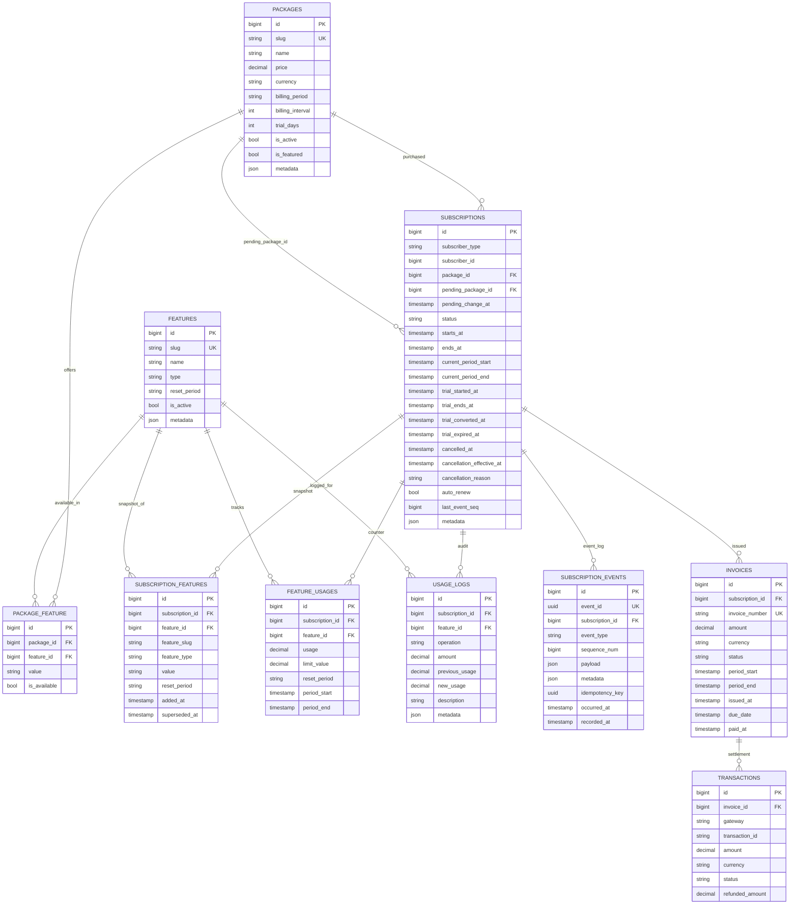

# DB Schema

All table names are prefixed (`tashil_` by default) and configurable via `config/tashil.php` under `database.prefix` and `database.tables`. The migration lives at `database/migrations/2024_01_01_000000_create_tashil_tables.php`.

## Entity Relationship Diagram

## Tables

### `tashil_packages`

Catalog of subscribable plans. Pricing, trial config, billing cadence.

| Column | Type | Notes |
|---|---|---|
| `id` | BIGINT PK | |
| `slug` | VARCHAR UNIQUE | Stable identifier used by builders / lookups. |
| `name` | VARCHAR | Display name. |
| `description` | TEXT NULL | |
| `price` | DECIMAL(10,2) | |
| `original_price` | DECIMAL(10,2) NULL | Optional strike-through price. |
| `currency` | CHAR(3) | ISO 4217, defaults to `tashil.currency` config. |
| `billing_period` | VARCHAR | `Period` enum: day, week, month, year, lifetime. |
| `billing_interval` | INT | Multiplier (e.g. `month` × 3 = quarterly). |
| `trial_days` | INT | Trial length; 0 disables. |
| `is_active`, `is_featured` | BOOL | |
| `sort_order` | INT | |
| `metadata` | JSON NULL | Host-app custom data. |
| `created_at`, `updated_at`, `deleted_at` | TIMESTAMP | Soft-deletes enabled. |

Indexes: `(is_active, is_featured)`, `(sort_order)`.

### `tashil_features`

Catalog of feature definitions independent of any plan.

| Column | Type | Notes |
|---|---|---|
| `id` | BIGINT PK | |
| `slug` | VARCHAR UNIQUE | Stable identifier used in code. |
| `name`, `description` | VARCHAR / TEXT NULL | |
| `type` | VARCHAR | `FeatureType` enum: `boolean`, `limit`, `consumable`, `enum`. |
| `reset_period` | VARCHAR | `ResetPeriod` enum: `never`, `daily`, `weekly`, `monthly`, `yearly`. Drives `tashil:reset-quotas`. |
| `is_active` | BOOL | Catalog kill-switch — when false, `UsageService::check()` refuses access globally. |
| `sort_order` | INT | |
| `metadata` | JSON NULL | |
| `created_at`, `updated_at`, `deleted_at` | TIMESTAMP | Soft-deletes enabled. |

### `tashil_package_feature` (pivot)

Per-plan feature configuration.

| Column | Type | Notes |
|---|---|---|
| `package_id` | BIGINT FK | cascadeOnDelete |
| `feature_id` | BIGINT FK | cascadeOnDelete |
| `value` | VARCHAR NULL | Limit amount or config value. Numeric values are parsed by tahsil as the limit; the raw string is also stored on the snapshot for boolean / enum features. |
| `is_available` | BOOL | If false, the feature is not synced on subscribe. |
| `sort_order` | INT | |

Unique: `(package_id, feature_id)`.

### `tashil_subscriptions` (aggregate root)

Current state of one subscription. Updated on every transition; the immutable history lives in `tashil_subscription_events`.

| Column | Type | Notes |
|---|---|---|
| `id` | BIGINT PK | |
| `subscriber_type`, `subscriber_id` | morphs | Polymorphic — any model using `HasSubscriptions`. |
| `package_id` | BIGINT FK | Current package. |
| `pending_package_id` | BIGINT NULL FK → packages | Target of a scheduled change (e.g. downgrade-at-period-end). |
| `pending_change_at` | TIMESTAMP NULL | When the scheduled change becomes effective. |
| `status` | VARCHAR | `SubscriptionStatus` enum. |
| `starts_at` | TIMESTAMP NULL | First activation. |
| `ends_at` | TIMESTAMP NULL | Lifetime cutoff. `null` for lifetime / open-ended. Advanced by the invoice-paid observer. |
| `current_period_start` | TIMESTAMP NULL | Start of the current billing window. |
| `current_period_end` | TIMESTAMP NULL | End of the current billing window — drives `tashil:renew-subscriptions`. |
| `trial_started_at` | TIMESTAMP NULL | |
| `trial_ends_at` | TIMESTAMP NULL | |
| `trial_converted_at` | TIMESTAMP NULL | Set when trial converts to paid; trials with this set are never expired by the job. |
| `trial_expired_at` | TIMESTAMP NULL | Set by the expire-trials job. |
| `cancelled_at` | TIMESTAMP NULL | Moment the user requested cancellation. |
| `cancellation_effective_at` | TIMESTAMP NULL | Moment at which cancellation actually revokes access. For immediate cancel this equals `now()`; for grace cancel it equals `ends_at`. |
| `cancellation_reason` | VARCHAR NULL | |
| `auto_renew` | BOOL | |
| `last_event_seq` | BIGINT | Cursor for the per-subscription event store. |
| `metadata` | JSON NULL | |
| `created_at`, `updated_at`, `deleted_at` | TIMESTAMP | Soft-deletes enabled. |

Indexes used by the scheduler and lookup paths:

- `(subscriber_type, subscriber_id, status)` — `subscribed()` / `subscription()` lookups.
- `(status, current_period_end)` — `tashil:renew-subscriptions`.
- `(status, ends_at)` — `tashil:expire-subscriptions` (auto_renew=false branch).
- `(status, trial_ends_at)` — `tashil:expire-trials` and `tashil:mark-trials-ending`.
- `(status, auto_renew, current_period_end)` — renewal filter.
- `(pending_change_at)` — `tashil:apply-pending-changes`.

### `tashil_subscription_features` (immutable snapshot)

Frozen view of a feature on a subscription. Written on `subscribe()` and again on every `switchPlan()` / `applyPendingChange()`. Old rows are stamped with `superseded_at`; they're never updated again and never deleted.

| Column | Type | Notes |
|---|---|---|
| `id` | BIGINT PK | |
| `subscription_id` | BIGINT FK | cascadeOnDelete |
| `feature_id` | BIGINT FK | cascadeOnDelete |
| `feature_slug` | VARCHAR | Denormalized for stable lookup independent of catalog renames. |
| `feature_type` | VARCHAR | Snapshotted from the feature at subscribe time. |
| `value` | VARCHAR NULL | The pivot value at subscribe time. |
| `reset_period` | VARCHAR | Snapshotted from the feature. |
| `added_at` | TIMESTAMP | |
| `superseded_at` | TIMESTAMP NULL | Set when the snapshot is replaced (plan change). |

Indexes: `(subscription_id, superseded_at)`, `(subscription_id, feature_id, superseded_at)`.

Immutability is enforced at the Eloquent layer — `SubscriptionFeature::booted()` throws on any update to a column other than `superseded_at` / `updated_at`, and on any delete.

### `tashil_feature_usages` (mutable counter)

Current usage value per (subscription, feature). Every change is also written to `tashil_usage_logs` for replay.

| Column | Type | Notes |
|---|---|---|
| `id` | BIGINT PK | |
| `subscription_id` | BIGINT FK | cascadeOnDelete |
| `feature_id` | BIGINT FK | cascadeOnDelete |
| `usage` | DECIMAL(20,4) | Current counter. Fractional supported (storage GB, AI compute hours). |
| `limit_value` | DECIMAL(20,4) NULL | Cached limit (null = unlimited). Cached on the counter so the atomic `UPDATE … WHERE usage + amount <= limit_value` is single-row. |
| `reset_period` | VARCHAR | Used by the reset job. |
| `period_start` | TIMESTAMP NULL | |
| `period_end` | TIMESTAMP NULL | The reset job zeroes counters whose `period_end <= now()` and advances the window anchored to the previous `period_end` (no drift if cron runs late). |

Unique: `(subscription_id, feature_id)`. Indexes: `(period_end, reset_period)`.

### `tashil_usage_logs` (append-only audit)

Every mutation to a `feature_usages` row writes one row here. Logs are never updated or deleted in the public API.

| Column | Type | Notes |
|---|---|---|
| `id` | BIGINT PK | |
| `subscription_id`, `feature_id` | BIGINT FK | cascadeOnDelete |
| `operation` | VARCHAR | `UsageOperation` enum: `consume`, `reset`, `adjust`, `report`. |
| `amount` | DECIMAL(20,4) | |
| `previous_usage`, `new_usage` | DECIMAL(20,4) NULL | Snapshot of the counter before/after. Enables full replay. |
| `description` | VARCHAR NULL | |
| `metadata` | JSON NULL | |
| `created_at`, `updated_at` | TIMESTAMP NULL | |

Index: `(subscription_id, feature_id, created_at)`.

### `tashil_subscription_events` (immutable event store)

Append-only log of every subscription state transition. Eloquent layer rejects updates and deletes (`SubscriptionEvent::booted()` throws).

| Column | Type | Notes |
|---|---|---|
| `id` | BIGINT PK | |
| `event_id` | UUID UNIQUE | Stable external identifier. |
| `subscription_id` | BIGINT FK | cascadeOnDelete |
| `event_type` | VARCHAR(64) | E.g. `subscription.created`, `subscription.cancelled`, `trial.expired`, `usage.reset`. |
| `sequence_num` | BIGINT | Strictly monotonic per subscription, assigned under a `FOR UPDATE` lock by `EventStore::append`. |
| `payload` | JSON NULL | Domain data for the event. |
| `metadata` | JSON NULL | Caller-supplied context (request id, actor, etc.). |
| `idempotency_key` | UUID NULL | When set, repeated `append()` with the same key returns the existing row. |
| `occurred_at`, `recorded_at` | TIMESTAMP | Logical vs storage time. |

Unique: `(subscription_id, sequence_num)`, `(subscription_id, idempotency_key)`.
Index: `(subscription_id, event_type, occurred_at)`.

### `tashil_invoices`

Bills tahsil issues on subscribe (non-trial) and on renewal. Status is the only mutable column after the row is committed.

| Column | Type | Notes |
|---|---|---|
| `id` | BIGINT PK | |
| `subscription_id` | BIGINT FK | cascadeOnDelete |
| `invoice_number` | VARCHAR UNIQUE | Generated by `InvoiceObserver::creating` via `tashil.invoice.generator`. |
| `amount`, `currency` | DECIMAL(10,2) / CHAR(3) | |
| `status` | VARCHAR | `InvoiceStatus` enum: `draft`, `pending`, `paid`, `void`, `refunded`. |
| `period_start`, `period_end` | TIMESTAMP NULL | The billing window the invoice covers. |
| `issued_at`, `due_date`, `paid_at` | TIMESTAMP | |
| `notes` | TEXT NULL | |
| `created_at`, `updated_at`, `deleted_at` | TIMESTAMP | Soft-deletes enabled. |

Index: `(subscription_id, status)`.

When status transitions to `Paid`, `InvoiceObserver::updated` advances `current_period_end` on the subscription, appends `subscription.renewed`, and fires `SubscriptionRenewed` + `InvoicePaid`.

### `tashil_transactions`

Optional ledger of gateway settlements linked to invoices. Tahsil itself never writes here — host apps record gateway responses.

| Column | Type | Notes |
|---|---|---|
| `id` | BIGINT PK | |
| `invoice_id` | BIGINT FK | cascadeOnDelete |
| `gateway` | VARCHAR | Defaults to `manual`. Identifies the payment source (e.g. `stripe`, `paddle`, `bkash`). |
| `transaction_id` | VARCHAR NULL | Gateway-supplied id, or auto-generated by `TransactionObserver::creating` via `tashil.transaction.generator` when empty (e.g. cash collected by an admin). |
| `amount`, `currency`, `status` | | |
| `gateway_response`, `metadata` | JSON NULL | |
| `refunded_amount`, `refunded_at`, `refund_reason` | | |

Indexes:

- `UNIQUE(gateway, transaction_id)` — reconciliation guard. Dedupes repeated gateway webhooks and enables safe upsert-by-(gateway, transaction_id). `transaction_id` stays NULLable; Postgres/MySQL/SQLite permit multiple NULLs in unique indexes, so pre-gateway-response rows are not blocked. Idempotent webhook retries that resend the same `transaction_id` are rejected at the DB layer.

## Soft deletes

`packages`, `features`, `subscriptions`, `invoices` use Laravel soft-deletes. Other tables (snapshot, counter, logs, events, transactions) intentionally do not — they are either append-only audit, or short-lived counters whose lifecycle is managed by the parent's cascade.

## Connection / table-name overrides

Every table name and the connection are pulled from `config('tashil.database.*')` at runtime. `BaseModel` resolves the table name from `class_basename → snake_plural` then looks up `tashil.database.tables.<key>` and prefixes with `tashil.database.prefix`, so renaming a table is a config change, not a code change.
