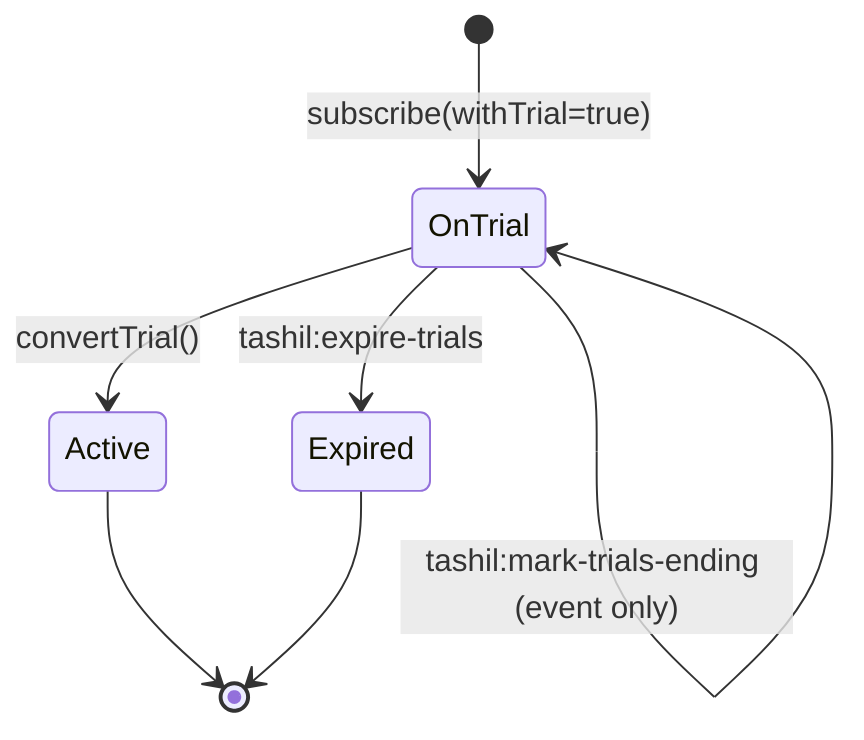

# Trial System

Trials are first-class state on the subscription. Tahsil tracks four distinct timestamps so the entire lifecycle is reconstructable:

| Column | Set when |
|---|---|
| `trial_started_at` | `subscribe(..., withTrial: true)` and the package has `trial_days > 0`. |
| `trial_ends_at` | Same moment, equals `trial_started_at + trial_days`. |
| `trial_converted_at` | Explicit `convertTrial()` call, or when the host marks an invoice paid during the trial window. |
| `trial_expired_at` | `tashil:expire-trials` runs when `trial_ends_at <= now() AND trial_converted_at IS NULL`. |

A trial's behaviour is entirely orthogonal to billing — the host third-party handles charging. Tahsil only owns the trial state and the related events.

## Lifecycle



The "mark-trials-ending" arrow is a no-op state-wise — it dispatches `TrialEnding` so the host can email/notify, but the subscription remains `OnTrial`.

## Starting a trial

```php
app('tashil')->subscription()->subscribe($user, $package, withTrial: true);
```

For this to start a trial, the package must define `trial_days > 0`. Tahsil sets:

- `status = OnTrial`
- `trial_started_at = now()`
- `trial_ends_at = now() + package.trial_days days`
- `current_period_start = now()`, `current_period_end = computed billing period end`

If `trial_ends_at > current_period_end`, `ends_at` is set to `trial_ends_at` so the subscription stays valid until the trial actually expires.

The event store gets `subscription.created` with `with_trial: true` in the payload.

## Strict `isOnTrial` semantics

`Subscription::isOnTrial()` returns true **only** when:

- `status === SubscriptionStatus::OnTrial`, **and**
- `trial_ends_at !== null`, **and**
- `trial_ends_at` is in the future.

A subscription that was on trial and is now cancelled or expired will not return `true` from `isOnTrial()` even if `trial_ends_at` is still future. This was a notable bug in earlier versions; the regression test lives in `tests/Unit/Models/SubscriptionStatusHelpersTest.php`.

## Approaching expiry — `TrialEnding`

The scheduled job `tashil:mark-trials-ending` (default daily 07:55) finds:

- `status = OnTrial`
- `trial_ends_at` between `now()` and `now() + tashil.trial.warn_days` (default 3)
- `trial_converted_at IS NULL`

For each, it appends `trial.ending` to the event store with an idempotency key `"trial-ending:{sub_id}:{date}"` and dispatches the `TrialEnding` event carrying the number of `daysRemaining`. The idempotency key guarantees that running the job twice on the same day re-sends nothing.

Host apps listen to `TrialEnding` to send notifications:

```php
Event::listen(TrialEnding::class, function ($event) {
    Mail::to($event->subscription->subscriber)->send(new TrialEndingMail($event->daysRemaining));
});
```

## Converting

Two ways:

1. **Explicit** — host calls `SubscriptionService::convertTrial($sub)`. Sets `status = Active`, `trial_converted_at = now()`, appends `trial.converted`, dispatches `TrialConverted`.
2. **Invoice-paid** — host marks an invoice as paid during the trial. Tahsil's `InvoiceObserver` advances `current_period_end` and fires `SubscriptionRenewed`. The host can also call `convertTrial()` from a listener on `InvoicePaid` to set `trial_converted_at`. Tahsil does not automatically infer conversion from payment; the host owns that policy because conversion semantics vary (some products treat any payment as conversion; others require an explicit upgrade).

## Expiring

`tashil:expire-trials` (default every 30 min) finds:

- `status = OnTrial`
- `trial_ends_at <= now()`
- `trial_converted_at IS NULL`

For each, it calls `SubscriptionService::expireTrial()` which sets:

- `status = Expired`
- `trial_expired_at = now()`

Appends `trial.expired` and dispatches `TrialExpired`. Idempotent — running the job again finds nothing because converted trials are filtered out by `trial_converted_at IS NULL` and expired trials by `status != OnTrial`.

## Grace after expiry

Hosts that want to keep trials in a limited-access window after expiry can implement that policy themselves — tahsil sets `trial_expired_at` so the host can compute the grace window. There's no built-in "grace state"; expired is expired from the package's point of view.

## Trial-aware plan switching

`switchPlan()` carries trial forward iff:

- The old subscription `isOnTrial()` returns `true`, **and**
- The new package has `trial_days > 0`.

In that case the new subscription starts in `OnTrial` with a fresh `trial_started_at` and a fresh `trial_ends_at` based on the new package's `trial_days`. This is intentional — switching plans mid-trial doesn't preserve the *remaining* days; it grants the new plan's full trial. Hosts that need the alternative ("preserve days") can call the lower-level `subscribe` directly with their own dates.

## Querying

```php
$sub->isOnTrial();
$sub->trial_ends_at;
$sub->trial_converted_at;
$sub->trial_expired_at;

// User-facing
$user->onTrial();
```

## Listening to trial events

| Event | Dispatched by | Payload |
|---|---|---|
| `TrialEnding` | `tashil:mark-trials-ending` | `$subscription`, `$daysRemaining` |
| `TrialConverted` | `convertTrial()` | `$subscription` |
| `TrialExpired` | `tashil:expire-trials` / `expireTrial()` | `$subscription` |

All three are dispatched **after** the DB commit via `DB::afterCommit()` when `tashil.events.async` is true (default), so listeners never see a torn state.
