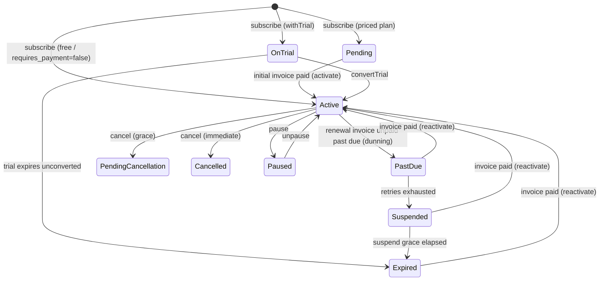

# Billing Lifecycle

How a subscription moves through money-related states: **activation** (first payment), **renewal**, **dunning** (failed payment), **reactivation** (recovery), and **plan change** (proration). Tahsil owns the *state machine, the invoices, and the schedule*; the host still moves the money (charges cards, funds wallets) — see [06-Developer-Guide.md](06-Developer-Guide.md#integrating-tahsil-with-the-hosts-billing--payments).

## State machine



## Activation (the `requires_payment` model)

Gating is decided by the **package's own `requires_payment` flag**. Under the default it is on, so **a priced plan does not grant access until its first invoice is paid.** The config `tashil.billing.activate_on_payment` (default `true`) is only the value `requires_payment` is *seeded with at package creation* when the caller doesn't set it — at runtime `requiresPayment()` reads the package, never the config (see [package-authoritative](#why-the-package-not-the-config) below).

| Package shape | `subscribe()` result | Invoice at subscribe |
|---|---|---|
| `price > 0`, `requires_payment = true` (default) | `Pending` — **no access** | `initial` invoice issued |
| `price = 0` **or** `requires_payment = false` | `Active` immediately | none |
| `withTrial` + `trial_days > 0` | `OnTrial` — access granted | none (issued at conversion) |

Flow for a priced, non-trial plan:

```
subscribe()
  status = Pending, no period, no access (isValid() = false)
  → BillingService::issueInitialInvoice (kind=initial, due = billing.initial_invoice_due_days)
  → InvoiceIssued
host charges the card → $invoice->markAsPaid()
InvoiceObserver::onPaid → SubscriptionService::activate($sub, $invoice)
  status = Active
  starts_at / current_period_start / activated_at = invoice.paid_at
  current_period_end = paid_at + billing period       ← period anchored to PAYMENT, not subscribe
  feature_usages counters re-anchored to paid_at
  → subscription.activated event, SubscriptionActivated
```

This closes the "free first period" gap — the paid period the customer consumes is the one they paid for. `activate()` is a no-op on any non-pending subscription.

**Legacy / opt-out.** Set `tashil.billing.activate_on_payment = false` so newly-created packages default to `requires_payment = false` ("access first, bill on renewal"), or set `requires_payment = false` on a specific package (free / offline / enterprise-invoiced plans) to activate immediately without an invoice. Because the flag is a creation default, flipping it does **not** change packages that already exist — update those rows explicitly if you want them to follow the new default.

### Why the package, not the config

`requires_payment` is a deliberate per-plan decision, so the package row is authoritative at runtime — `SubscriptionService::requiresPayment()` reads only the package (`requires_payment && price > 0`). The config is consulted exactly once, in `Package::booted()`, to seed the flag when the caller didn't pass it. This avoids the "config overrides data" footgun: a plan explicitly marked `requires_payment = true` keeps collecting payment even if someone later flips the install-wide default to `false`. If you need an emergency "let everyone in" override (e.g. the gateway is down), add a separately-named incident switch rather than overloading this default.

## Trial conversion

`convertTrial()` ends a trial as a paying customer:

- `status = Active`, `trial_converted_at = now`, `activated_at = now`.
- The first paid period is anchored to the **conversion moment** (not the original trial-subscribe), and counters re-anchor with it.
- For priced plans, the first `initial` invoice is issued. Paying it records the payment without advancing the just-anchored period (initial invoices never advance).

Trials are **never billed by the renewal cron** — `dueForRenewal` selects `Active` only. A trial whose `trial_days` outlive the first billing window is therefore not billed mid-trial.

## Renewal

`tashil:renew-subscriptions` issues a `renewal` invoice for `Active`, `auto_renew` subscriptions whose `current_period_end` has elapsed. It does **not** advance the period — that happens when the host marks the invoice paid:

```
InvoiceObserver::onPaid (renewal, Active/OnTrial) → advancePeriod()
  current_period_start = previous current_period_end
  current_period_end   = previous end + billing period   (anchored, no drift)
  → subscription.renewed, SubscriptionRenewed
```

`advancePeriod()` is guarded: it is a no-op for any non-`Active`/`OnTrial` subscription, so a stray paid invoice can never silently shift the period of a cancelled, paused, or expired subscription.

### `on_pending_invoice` policy

If a pending invoice already exists at renewal time (`tashil.renewal.on_pending_invoice`):

| Policy | Action |
|---|---|
| `cancel` (default) | Grace-cancel the subscription. |
| `skip` | Log and retry next run. |
| `extend_grace` | Push `current_period_end` by `renewal.grace_days`, **capped at `renewal.max_grace_extensions`** (counter stored in `dunning_attempts`). Once exhausted, stop extending and let dunning take over — an unpaid invoice can no longer extend access forever. |

## Dunning (`tashil:process-dunning`)

Drives unpaid `renewal` invoices past their `due_date` through a bounded recovery cycle. Config under `tashil.dunning`:

```
Active --(retry milestone reached)--> PastDue        fires SubscriptionPastDue + InvoiceOverdue
PastDue --(each new milestone)------> PastDue (++)    fires InvoiceOverdue (host re-charges)
PastDue --(attempts >= suspend_after)--> Suspended   fires SubscriptionSuspended (access cut)
Suspended --(+ cancel_after_suspend_days)--> Expired
```

- `retry_days` (default `[1, 3, 5]`) — days after `due_date` at which an attempt fires. The attempt count is the number of elapsed milestones.
- `suspend_after_attempts` (default `3`) — suspend once attempts reach this.
- `cancel_after_suspend_days` (default `7`) — expire a still-unpaid suspended subscription this many days after suspension.
- `keep_access_while_past_due` (default `true`) — **soft dunning**: a `PastDue` subscription keeps access during the retry window (`isValid()` true). `Suspended` never has access. Set `false` for hard dunning (cut access on the first `PastDue`).

Tahsil fires `SubscriptionPastDue` / `InvoiceOverdue` so the host re-attempts the charge; Tahsil never moves money. Disable the whole cycle with `tashil.dunning.enabled = false`.

## Reactivation

Paying an invoice on a lapsed subscription (`PastDue` / `Suspended` / `Expired`) recovers it:

```
InvoiceObserver::onPaid (lapsed status) → SubscriptionService::reactivate($sub, $invoice)
  status = Active
  dunning_attempts = 0, last_dunning_at = null, suspended_at = null
  period: keeps a still-future period as-is, else starts fresh from payment
  → subscription.reactivated, SubscriptionReactivated
```

This closes the "paid but still locked out" gap — recovery restores access, it doesn't just shift dates. `reactivate()` is a no-op for any non-lapsed status (so paying a stray invoice on a cancelled subscription does nothing).

## Plan change & proration

Two ways to move plans:

| Method | Shape | Use for |
|---|---|---|
| `changePlan($new, prorate: true)` | In place — **same** subscription row, period + usage kept | Upgrades / lateral moves on a live plan |
| `switchPlan($new)` | Cancel old + create new subscription | Cross-product moves, scheduled downgrades (`applyPendingChange`) |

`changePlan()` classifies by **normalized monthly price**:

- **Upgrade / lateral** → applied immediately in place. Feature snapshots are superseded and re-written from the new plan; usage counters are **carried forward** (caps + reset cadence updated to the new plan, the usage value kept). The prorated delta for the remainder of the current period is billed on a `proration` invoice:

  ```
  delta = (newPrice − oldPrice) × (remaining seconds / period seconds)
  ```

  Issued only when `delta >= tashil.billing.min_proration_amount` (dust changes skip the invoice). The period end is unchanged; the next renewal bills the new full price.

- **Downgrade** → deferred to period end via `scheduleDowngrade()` (the current period is already paid).

Cross-currency proration throws — cancel and resubscribe instead.

## Pause

`pause()` freezes the clock: the remaining access time (seconds until `ends_at`) is banked in `metadata.paused_remaining_seconds`. `unpause()` adds it back from the resume moment, so a paused subscription never silently burns the customer's remaining paid time. Lifetime / open-ended subscriptions bank nothing.

## Events reference

| Event | Fired when |
|---|---|
| `SubscriptionActivated` | `Pending → Active` (first payment) or a free/offline plan created active |
| `SubscriptionPastDue` | renewal invoice unpaid past due — carries the invoice + attempt number |
| `InvoiceOverdue` | each dunning attempt (host re-charges) |
| `SubscriptionSuspended` | dunning retries exhausted — access cut |
| `SubscriptionReactivated` | lapsed subscription recovered by payment |
| `SubscriptionPlanChanged` | in-place plan change (upgrade/lateral) — carries the proration amount + invoice |

See [05-Reporting-Data-Model.md](05-Reporting-Data-Model.md) for the corresponding event-store `event_type`s.
